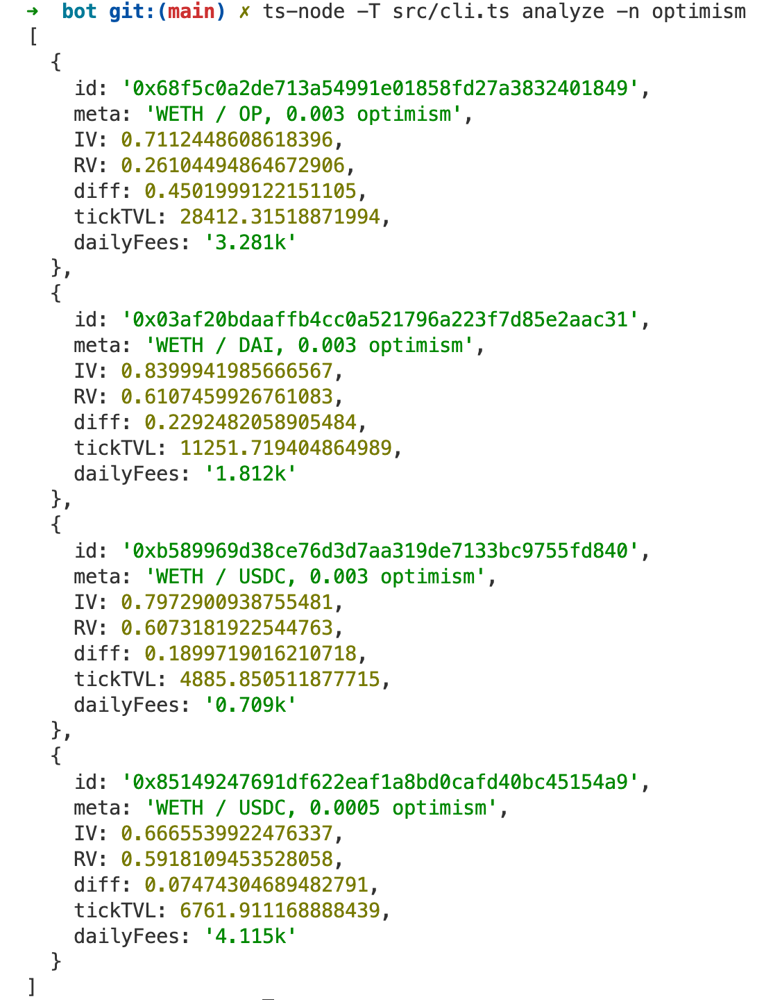

# Uniswap LP Scripts

Finds analyzes top Uniswap pools on every chain to pools with high volume but under-supplied ticks. Ranks pools using [Guillame Lambert's method](https://lambert-guillaume.medium.com/on-chain-volatility-and-uniswap-v3-d031b98143d1) of finding an LP share's implied volatility, compared to the realized daily volatility over the past week.

Ranks pools by the difference between IV and RV, and filters out small pools.

## To run

- npm install
- npx ts-node -T src/cli.ts analyze -n optimism

### Example output

